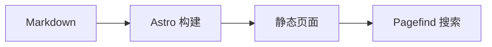

<script setup>
import { onMounted, ref } from 'vue'

const dynamicCards = ref([])
onMounted(() => {
  dynamicCards.value = [
    { image: '/img/logo.svg', title: '动态图片卡片', description: '由 v-for 与 v-bind 渲染。', author: 'ermaozi', date: '2026-08-06', width: 240, center: true },
  ]
})
</script>

# 增强 Markdown 展示

这个页面覆盖主题内置的主要 Markdown 扩展，可作为写作速查表。

<!-- more -->

## 文本与任务

普通 Markdown 支持 **加粗**、`行内代码` 和 ==重点标记==。

行内注释需要点击图标查看补充内容 [+静态站点]。

[+静态站点]:
  静态站点在构建阶段生成 HTML，访问时无需持续运行应用服务器。

- [x] 配置站点信息
- [x] 写一篇示例文章
- [ ] 替换示例内容

## 提示框

::: warning 发布前检查
请把 `https://example.com` 换成真实域名，并确认 sitemap 中的链接正确。
:::

## 折叠面板

::: collapse accordion
- :+ 默认展开

  折叠面板支持点击、键盘操作和手风琴模式。

- :- 默认收起

  适合放置补充说明或较长的代码示例。
:::

## 标签页

::: tabs#package-manager
@tab pnpm

```bash
pnpm install
```

@tab npm

```bash
npm install
```
:::

::: tabs#package-manager
@tab pnpm#pnpm

共享状态：pnpm

@tab npm#npm

共享状态：npm
:::

::: code-tabs#install-command
@tab npm

```bash
npm install
```

@tab:active pnpm

```bash
pnpm install
```

@tab yarn

```bash
yarn install
```
:::

## Mermaid



## 时间线

::: timeline card placement="between" line="dashed"
- 初始化项目
  time=第一步 type=success icon=mdi:package-variant-closed placement=right card=false

  安装依赖并填写站点配置。

- 编写内容
  time=第二步 type=warning icon=mdi:pencil

  使用 Markdown 和主题组件组织页面。

- 构建发布
  time=第三步 type=important icon=mdi:rocket-launch-outline placement=right

  完成检查后生成静态文件。
:::

## 图片卡片与瀑布流

<ImageCard
  image="/img/logo.svg"
  title="主题图片卡片"
  description="悬停信息区域可查看完整描述。"
  author="Theme Author"
  date="2026-08-05"
  width="320"
  center
/>

<CardGrid :cols="{ sm: 1, md: 2, lg: 3 }">
  <LinkCard title="响应式一" href="/docs/" />
  <LinkCard title="响应式二" href="/docs/guide/configuration/" />
  <LinkCard title="响应式三" href="/docs/guide/content/" />
</CardGrid>

<Card>
  <template #title><span data-card-custom-title style="color:#c62828">自定义标题插槽</span></template>
  任意标题插槽内容仍保留 Markdown 正文。
</Card>

<CardGrid cols="1">
  <ImageCard v-for="item in dynamicCards" :key="item.image" v-bind="item" />
</CardGrid>

:::: card-masonry :cols="{ sm: 1, md: 2, lg: 3 }" gap="16"
::: card title="短卡片"
适合放置简短摘要。
:::

::: card title="较长卡片"
瀑布流会根据每项渲染后的高度，将内容放入当前最短的列。

它支持卡片、图片、代码块等普通 Markdown 内容。
:::

::: card title="第三张卡片"
窗口尺寸变化后会重新计算列布局。
:::
::::

## 步骤与布局

::: steps
1. 安装依赖

   选择 npm、pnpm 或 Yarn。

2. 编写内容

   使用 Markdown 维护页面。

3. 构建站点

   输出可直接托管的静态文件。
:::

::: flex between wrap gap="12"
**响应式布局**

**支持自动换行**
:::

## 窗口

::: window title="ermaozi" height="180" gap="16"
窗口容器支持标题、高度和内容间距。

```bash
npm run build
```
:::

## 代码树

::: code-tree title="示例项目" height="260" entry="src/index.ts"
```ts title="src/index.ts" :active
export const theme = 'plume'
```

```ts title="src/config.ts"
export const locale = 'zh-CN'
```

```json title="package.json"
{ "scripts": { "build": "astro build" } }
```
:::

@[code-tree title="目录导入示例" height="260" entry="src/index.ts"](/snippets/code-tree-example)

## 包状态徽章

<NpmBadgeGroup name="astro" repo="withastro/astro" items="version,stars,license" />

<NpmBadgeGroup name="astro" repo="withastro/astro" theme="flat-square">
  <NpmBadge type="version" label="Astro" />
  <NpmBadge type="dm" label="monthly" />
</NpmBadgeGroup>

## 图标

Iconify 图标支持尺寸、颜色和远程集合回退：::simple-icons:astro =28 /#bc52ee:: ::mdi:home::

直接组件语法同样可用：<VPIcon provider="iconify" name="simple-icons:astro" size="24" color="#bc52ee" />

提供器外壳：<span class="icon-provider-matrix">Iconify ::simple-icons:astro =24x16 /#bc52ee class="provider-icon provider-iconify" id="provider-iconify":: IconFont ::iconfont home =24 /#2e7d32 class="provider-icon provider-iconfont" id="provider-iconfont":: Font Awesome ::fontawesome fas:house =24x16 /#c62828 border class="provider-icon provider-fontawesome" id="provider-fontawesome":: 组件 <Icon provider="fontawesome" name="ds:house" size="24x16" color="#1565c0" extra="2xl" class="provider-icon provider-component" id="provider-component" /></span>

## 二维码

@[qrcode card title="示例站点" align="center" logo="/img/logo.svg" logo-size="0.25"](https://example.com)

::: flex wrap gap="12"
@[qrcode title="当前页面" width="96" level="Q" version="8" mask="2" margin="1" scale="3" dark="#336f87ff" light="#ffffffff"](.)

@[qrcode title="文档首页" width="96"](/docs/index.md)
:::

::: qrcode card reverse align="right" title="多行文本"
第一行
第二行
:::

## 局部内容加密

::: encrypt password="246810" hint="请输入演示密码 246810"
### 加密片段标题

局部加密验证内容：只有成功解密后才会进入页面 DOM。
:::

## 文件引入与代码导入

<!-- @include: ../../snippets/include-example.snippet.md#intro -->

@[code{2-4} javascript{2}](../../snippets/import-example.js)

## 多包管理器命令

::: npm-to
```bash
npm install astro --save-dev
```
:::
