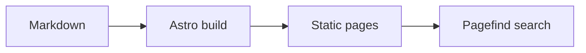

<script setup>
import { onMounted, ref } from 'vue'

const dynamicCards = ref([])
onMounted(() => {
  dynamicCards.value = [
    { image: '/img/logo.svg', title: 'Dynamic image card', description: 'Rendered by v-for and v-bind.', author: 'ermaozi', date: '2026-08-06', width: 240, center: true },
  ]
})
</script>

# Enhanced Markdown showcase

This page demonstrates the main Markdown extensions included with the theme.

<!-- more -->

## Text and tasks

Regular Markdown supports **bold text**, `inline code`, and ==marked text==.

- [x] Configure the site
- [x] Write a sample post
- [ ] Replace the sample content

## Callouts

::: warning Before publishing
Replace `https://example.com` with your real origin and verify every sitemap URL.
:::

## Collapses

::: collapse accordion
- :+ Open by default

  Collapse panels support pointer and keyboard interaction.

- :- Closed by default

  Use them for optional details or longer examples.
:::

## Tabs

::: tabs#package-manager
@tab pnpm

```bash
pnpm install
```

@tab npm

```bash
npm install
```
:::

::: tabs#package-manager
@tab pnpm#pnpm

Shared state: pnpm

@tab npm#npm

Shared state: npm
:::

::: code-tabs#install-command
@tab npm

```bash
npm install
```

@tab:active pnpm

```bash
pnpm install
```

@tab yarn

```bash
yarn install
```
:::

## Mermaid



## Timeline

::: timeline card placement="between" line="dashed"
- Initialize the project
  time="Step one" type=success icon=mdi:package-variant-closed placement=right card=false

  Install dependencies and fill in the site configuration.

- Write content
  time="Step two" type=warning icon=mdi:pencil

  Organize pages with Markdown and theme components.

- Build the site
  time="Step three" type=important icon=mdi:rocket-launch-outline placement=right

  Generate static files after all checks pass.
:::

## Steps and layout

::: steps
1. Install dependencies
2. Write content
3. Build the site
:::

::: flex between wrap gap="12"
**Responsive layout**

**Automatic wrapping**
:::

## Window

::: window title="ermaozi" height="180" gap="16"
Window containers support a title, height, and content gap.

```bash
npm run build
```
:::

## Code tree

@[code-tree title="Directory import example" height="260" entry="src/index.ts"](/snippets/code-tree-example)

## Icons

Iconify icons support inline size, color, and remote collection fallback: ::simple-icons:astro =28 /#bc52ee:: ::mdi:home::

Direct component syntax works too: <VPIcon provider="iconify" name="simple-icons:astro" size="24" color="#bc52ee" />

Provider shells: <span class="icon-provider-matrix">Iconify ::simple-icons:astro =24x16 /#bc52ee class="provider-icon provider-iconify" id="provider-iconify":: IconFont ::iconfont home =24 /#2e7d32 class="provider-icon provider-iconfont" id="provider-iconfont":: Font Awesome ::fontawesome fas:house =24x16 /#c62828 border class="provider-icon provider-fontawesome" id="provider-fontawesome":: component <Icon provider="fontawesome" name="ds:house" size="24x16" color="#1565c0" extra="2xl" class="provider-icon provider-component" id="provider-component" /></span>

<CardGrid :cols="{ sm: 1, md: 2, lg: 3 }">
  <LinkCard title="Responsive one" href="/en/docs/" />
  <LinkCard title="Responsive two" href="/en/docs/guide/configuration/" />
  <LinkCard title="Responsive three" href="/en/docs/guide/content/" />
</CardGrid>

<Card>
  <template #title><span data-card-custom-title style="color:#c62828">Custom title slot</span></template>
  Arbitrary title-slot content keeps the Markdown body.
</Card>

<CardGrid cols="1">
  <ImageCard v-for="item in dynamicCards" :key="item.image" v-bind="item" />
</CardGrid>

## QR code

@[qrcode card title="Example site" align="center" logo="/img/logo.svg" logo-size="0.25"](https://example.com)

::: flex wrap gap="12"
@[qrcode title="Current page" width="96" level="Q" version="8" mask="2" margin="1" scale="3" dark="#336f87ff" light="#ffffffff"](.)

@[qrcode title="Documentation" width="96"](/en/docs/index.md)
:::

::: qrcode card reverse align="right" title="Multiple lines"
First line
Second line
:::
